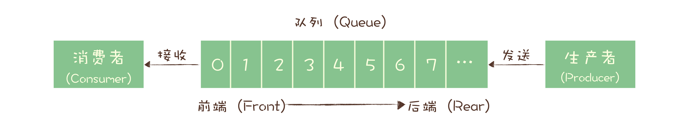
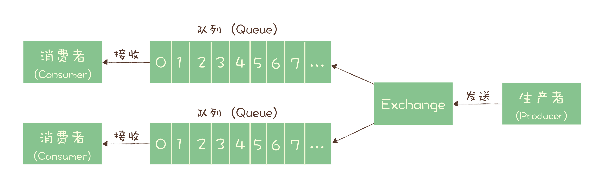
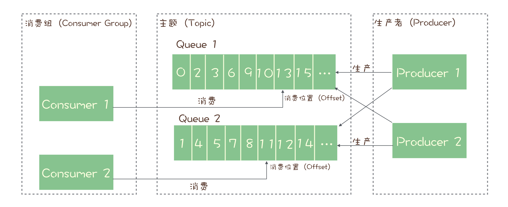
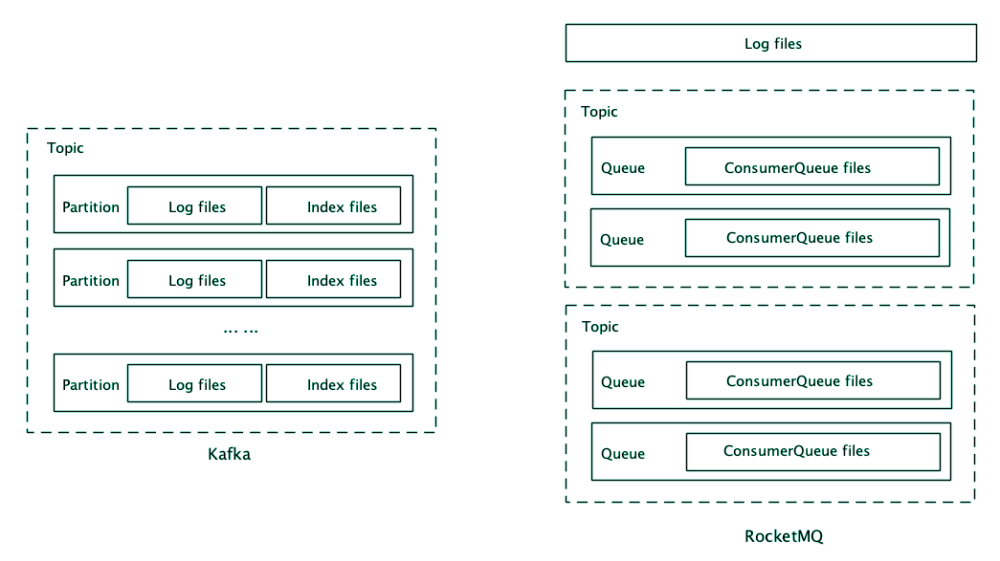

# 消息队列

两种队列模型：

- 队列模型

  

- 发布 - 订阅模型

## Kafka/RocketMQ/RabbitMQ

### RabbitMQ

- 消费模型
  - 使用队列模型
  - Exchange模块处于Pub和Con之间，根据其上的策略来决定消息发送到哪个队列中
- RabbitMQ 对消息堆积的支持并不好
- 性能较差，每秒几万到十几万条消息
- 编程语言 Erlang 小众，学习曲线陡峭

### RocketMQ

- 消费模型
  - 为了保证消息的可靠性，RMQ使用请求确认机制
  - 为了确保消息的有序性，在某一条消息被成功消费之前，下一条消息是不能被消费的，否则就会出现消息空洞，违背了有序性这个原则。
  - 每个主题包含多个队列，通过多个队列来实现多实例并行生产和消费。
    - 只在队列上保证消息的有序性，主题层面是无法保证消息的严格顺序的。
  - 订阅者的概念是通过消费组（Consumer Group）来体现的
    - 每个消费组都消费主题中一份完整的消息，不同消费组之间消费进度彼此不受影响
    - 消费组内消费者时竞争关系，不能重复消费同一条消息
    - 由于消息需要被不同的组进行多次消费，所以消费完的消息并不会立即被删除，这就需要 RocketMQ 为每个消费组在每个队列上维护一个消费位置（Consumer Offset）
- 不错的性能，稳定性和可靠性
- 社区活跃
- Java 语言开发，文档丰富
- 对响应延时做了很多优化，毫秒级响应，最好
- 每秒钟大概能处理几十万条消息

### Kafka

- 消息模型
  - 与RocketMQ一致，不同处在于队列名为分区Partition
- 数据可靠性、稳定性和功能特性等方面都可以满足绝大多数场景的需求
- 与周边生态系统的兼容性是最好的没有之一，尤其在大数据和流计算领域，几乎所有的相关开源软件系统都会优先支持 Kafka。
- 基于批量和异步的思想设计，性能最高，处理几十万条消息到上千万条
- 由于异步和批量设计，延时较高，不太适合在线业务场景

## RocketMQ生产消息过程

#### 使用的设计模式

1. 门面模式：DefaultMQProducer，用于封装内部复杂实现
2. 状态模式：DefaultMQProducerImpl，serviceState，内部状态改变时改变它的行为
3. 单例模式：MQClientManager，该类负责创建自己的对象，同时确保只有单个对象被创建
4. 

## 问题

### 1.如何处理消费过程中的重复消息？

1. 用幂等性解决重复消息问题
   - 并发不高，先查再保存
   - 数据库将来都不会分库分表，业务表添加约束条件
   - 添加消息表
   - 使用 Redis
   - 分布式并发锁

### 2.如何确保消息不会丢失?

### 3. 如何利用事务消息实现分布式事务？

事务消息适用的场景主要是那些需要异步更新数据，并且对数据实时性要求不太高的场景。

- 先发送半消息
- 执行本地事物
- 根据本地事物结果执行提交或回滚消息(提交后半消息才能被消费端看到)
  - 提交失败怎么办：
    - Kafka：直接抛异常，由用户处理对应逻辑。 
    - RocketMQ：事物反查机制，Broker未收到提交或回滚时，定期去Producer上查询事物对应本地的状态，根据查询结果决定是否提交。业务代码中要实现一个反查本地事物状态的接口。TransactionCheckListener

### 4. 消息积压了该如何处理？

原因：

- 由于系统中某个部分出现了性能问题，导致来不及处理上游发送的消息
- 消费失败过多

处理：

- 优化性能来避免消息积压
  - 生产端
    - 批量或增加并发，看是否在乎时延
  - 消费端
    - 水平扩容，在扩容 Consumer 的实例数量的同时，必须同步扩容主题中的分区（也叫队列）数量，确保 Consumer 的实例数和分区数量是相等的
    - 优化消费端性能

### 5.主流消息队列都是如何存储消息的？

- Kafka
  - 以 Partition 为单位，每个 Partition 包含一组消息文件（Segment file）和一组索引文件（Index），文件名就是这个文件中第一条消息的索引序号
  - 索引=索引序号+绝对位置   稀疏索引
  - 查找时，用二分查找，需要部分时间
- RocketMQ
  - 储以 Broker 为单位，分为消息文件和索引文件
  - 按照主题和队列分别建立的，每个队列对应一组索引文件
  - 定长稠密索引，每个消息固定长度为20个字节
  - 查找时，直接根据队列的消息序号，计算出索引的全局位置（索引序号 x 索引固定长度 20），较快

### 6.如何确保消息不会丢失?

- 检测消息丢失的方法
  - 为每个消息设置有序的序号来验证是否有消息丢失
  - Producer为多实例时，分别生成附近Producer标识的消息虚幻
- 确保消息可靠传递
  - 生产阶段：
    - 请求确认机制，当请求未收到确认响应时，会自动重试，再失败会返回失败响应或异常
    - 代码中要对异常进行正确处理
  - 存储阶段
    - 单节点Broker通过配置参数，将消息同步写入磁盘，RocketMQ 中，需要将刷盘方式 flushDiskType 配置为 SYNC_FLUSH 同步刷盘
    - 集群中，将Broker集群配置成，至少将消息发送到2个节点以上，再返回响应。
  - 消费阶段
    - 请求确认机制，业务逻辑执行成功后再发送成功响应
    - 如果业务逻辑成功，但是确认消息失败，需要用幂等性避免重复消费

